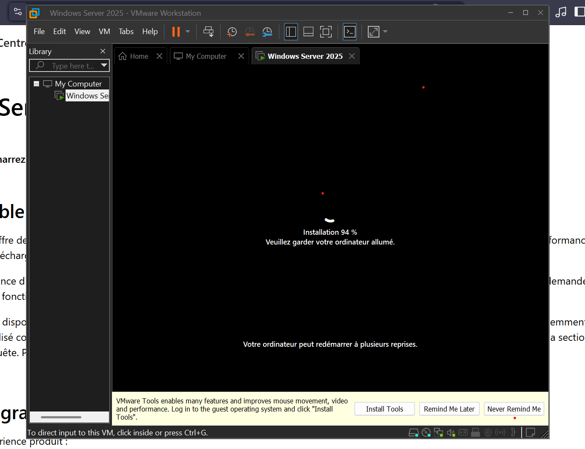
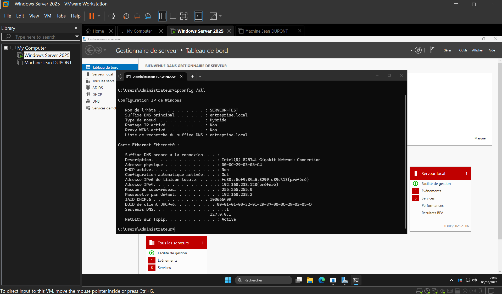
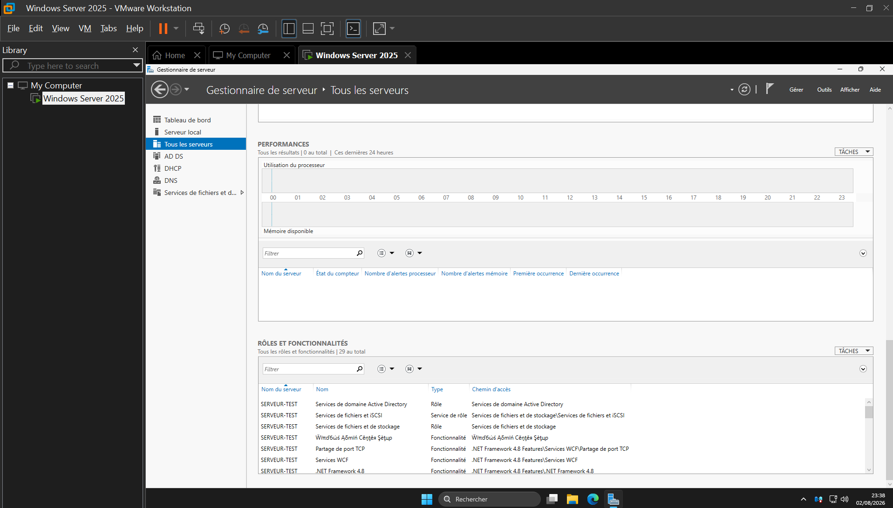
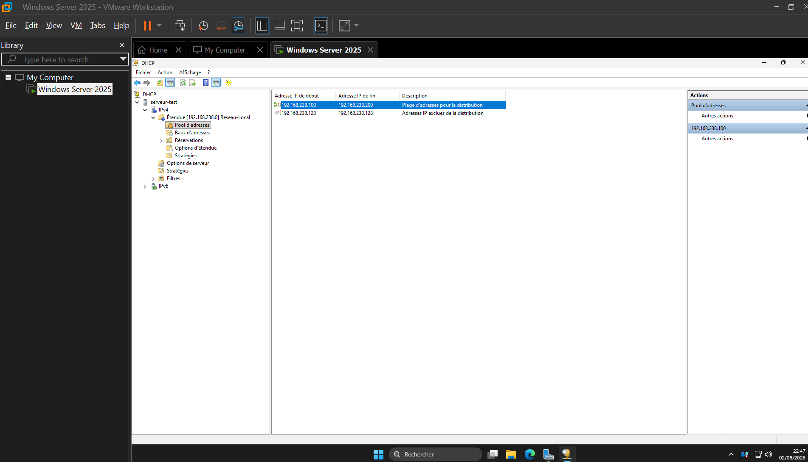
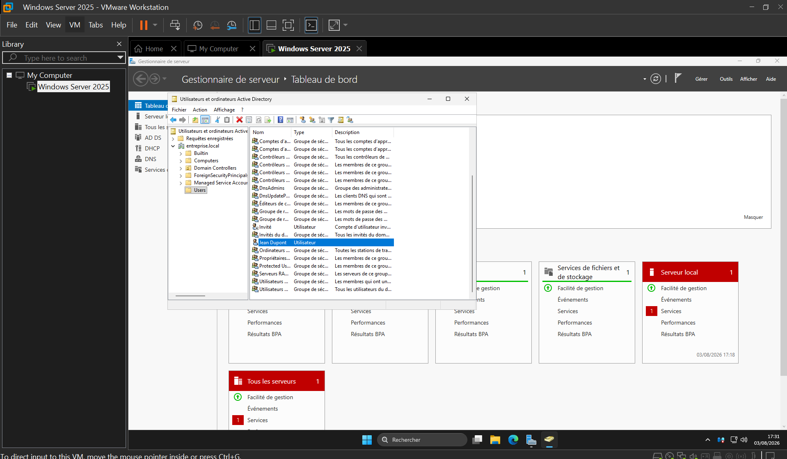
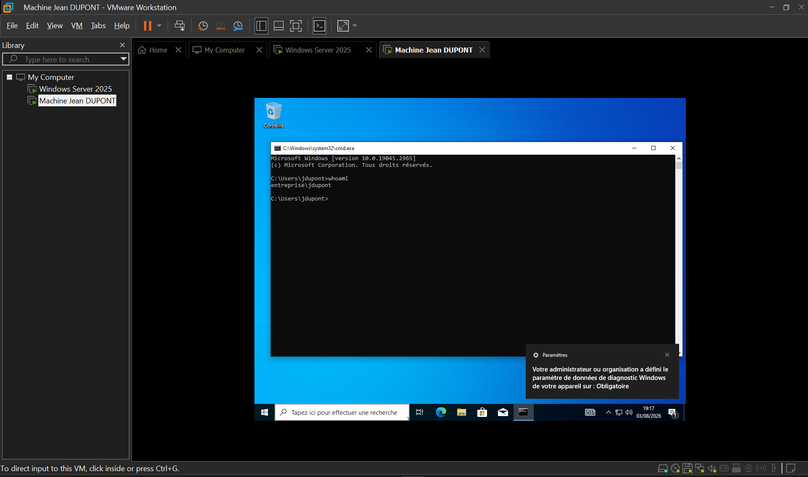

# Maquette Système & Réseau : Windows Server 2025 + Client Windows 10

## Description du Projet

Ce projet personnel vise à concevoir et déployer une infrastructure réseau d'entreprise virtualisée sous **VMware Workstation**. L'objectif principal est de simuler un environnement professionnel pour comprendre les interactions fondamentales entre un serveur contrôleur de domaine et un poste client.

En tant que candidat à un poste de **Technicien Support**, cette maquette m'a permis de pratiquer concrètement la gestion centralisée des utilisateurs et des ressources réseau.

---

## Stack Technique & Outils

* **Hyperviseur :** VMware Workstation Pro
* **Serveur :** Windows Server 2025 (Évaluation)
* **Poste Client :** Windows 10 Enterprise (22H2)
* **Rôles & Services Déployés :**
  * **AD DS** (Active Directory Domain Services)
  * **DNS** (Domain Name System)
  * **DHCP** (Dynamic Host Configuration Protocol)

---

## Configuration Réseau (Logique)

Afin d'assurer la stabilité des services critiques (AD, DNS), une configuration IP statique a été appliquée sur le serveur.

| Composant | Nom d'hôte | Rôle | IP / Masque | Passerelle (NAT) | DNS |
| :--- | :--- | :--- | :--- | :--- | :--- |
| **Serveur DC** | `SERVEUR-TEST` | DC / DNS / DHCP | `192.168.238.128` / 24 | `192.168.238.2` | `192.168.238.2` |
| **Domaine AD** | `entreprise.local` | - | - | - | - |
| **Poste Client** | `Machine Jean DUPONT` | Client Joint | Dynamique (DHCP) | Fournie par DHCP | Fournie par DHCP |

---

## Chronologie du Déploiement & Explications Techniques

Cette section détaille les étapes techniques réalisées et la logique d'ingénierie appliquée à chaque phase.

### Phase 1 : Préparation & Installation

L'environnement virtuel a été dimensionné pour garantir la stabilité des services Active Directory et DHCP (4 Go de RAM et 2 vCPU attribués à la machine virtuelle serveur). L'installation de Windows Server 2025 et de Windows 10 a été effectuée à partir des images ISO d'évaluation officielles de Microsoft.



### Phase 2 : Configuration Initiale du Serveur

Un contrôleur de domaine nécessite une configuration fixe et prévisible avant sa mise en service :

1. **IP Statique :** L'attribution de l'adresse fixe `192.168.238.128` garantit que le serveur reste joignable en permanence par les postes clients pour l'authentification et la résolution DNS.
2. **VMware Tools :** Déploiement des pilotes pour optimiser l'intégration réseau et les performances de la machine virtuelle.
3. **Mises à jour système :** Application des derniers correctifs de sécurité avant la promotion du serveur.

La configuration de l'adaptateur réseau a été validée via la commande `ipconfig /all`.



### Phase 3 : Installation des Rôles (AD DS, DNS, DHCP)

La centralisation de la gestion des utilisateurs repose sur le service **Active Directory (AD DS)**, qui requiert le rôle **DNS** pour la localisation des services d'authentification (Kerberos, LDAP). Le rôle **DHCP** a également été installé sur ce serveur pour automatiser l'attribution des adresses IP sur le réseau.

L'installation a été réalisée via l'assistant du Gestionnaire de serveur en incluant les outils d'administration distante (RSAT).



### Phase 4 : Configuration Étendue DHCP

L'automatisation de l'adressage IP des postes clients s'articule autour des paramètres suivants :

1. **Plage d'adressage :** Création de l'étendue nommée `Reseau-Local`.
2. **Exclusions d'adresses :** Exclusion explicite de l'adresse IP du serveur (`192.168.238.128`) de la plage d'attribution pour prévenir tout conflit d'IP.
3. **Options d'étendue :** Configuration de la passerelle par défaut (`192.168.238.2`) transmise automatiquement aux équipements du réseau.



### Phase 5 : Administration Active Directory

L'annuaire Active Directory permet de centraliser les identités des collaborateurs. Depuis la console "Utilisateurs et ordinateurs Active Directory" (ADUC), un compte utilisateur de test (`jdupont@entreprise.local`) a été créé pour simuler l'intégration d'un nouvel employé.



### Phase 6 : Déploiement Client & Jonction

Cette étape valide l'interconnexion globale des services de la maquette :

1. Le service **DHCP** attribue une adresse IP dynamique au poste Windows 10.
2. Le service **DNS** résout le nom de domaine `entreprise.local`.
3. L'**Active Directory** valide la jonction de la machine et permet l'ouverture de session du compte `jdupont`.

La commande `whoami` exécutée sur le poste client confirme que la session est bien ouverte sous l'autorité du domaine (`entreprise\jdupont`).



---

## Conclusion & Apprentissage

Ce projet m'a permis de mettre en pratique les concepts fondamentaux de l'administration système : l'interaction entre le DHCP, le DNS et Active Directory lors de l'intégration d'un poste de travail. Cette réalisation constitue une base solide pour la gestion de parc informatique et le support utilisateur en entreprise.

# 🛠️ Maquette Windows Server 2025 : AD DS, DHCP, DNS & Automatisation PowerShell

Ce dépôt rassemble la documentation technique et les scripts de déploiement d'une infrastructure réseau sous **Windows Server 2025**, combinant les services de domaine **Active Directory (AD DS)**, **DHCP**, **DNS**, ainsi qu'une solution d'**automatisation du provisioning d'utilisateurs** en PowerShell.

---

## 📌 Vue d'ensemble du Projet

L'objectif de ce projet est de modéliser l'infrastructure réseau et l'annuaire d'une entreprise (`entreprise.local`), puis d'industrialiser la création et l'affectation des nouveaux collaborateurs à partir d'un fichier transmis par le service RH.

### Fiche technique de l'environnement :
* **Système d'exploitation :** Windows Server 2025 Datacenter
* **Nom de domaine AD :** `entreprise.local`
* **Rôles installés :** AD DS (Domain Controller), DNS Server, DHCP Server
* **Unités d'Organisation (OU) :** `RH`, `Technique`
* **Groupes de Sécurité :** `RH`, `Technique`

---

## 📁 Structure du Dépôt GitHub

```text
Maquette-Windows-Server-2025-AD-DHCP-DNS/
├── README.md
├── docs/
│   ├── github-upload.png              # Upload des fichiers via l'interface GitHub
│   ├── execution-powershell.png       # Exécution du script PowerShell dans le terminal
│   ├── ad-ou-rh.png                   # Vérification de l'OU RH dans dsa.msc
│   └── ad-ou-technique.png            # Vérification de l'OU Technique dans dsa.msc
└── scripts/
    ├── ADUsers.ps1                    # Script PowerShell d'automatisation
    └── nouveaux_collaborateurs.csv    # Source de données RH au format CSV
